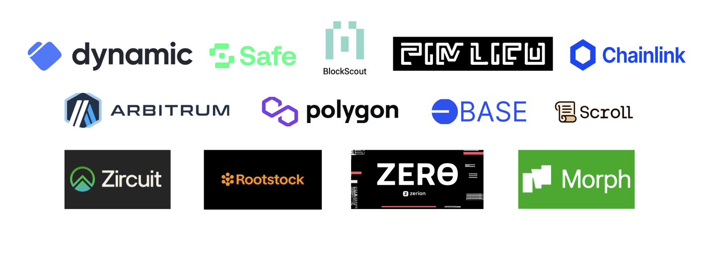

#  🏗 Project is started based on _Hackathon Starter Kit Version_



🧪 An open-source, up-to-date toolkit for building decentralized applications (dapps) on the Ethereum blockchain. It's designed to make it easier for developers to create and deploy smart contracts and build user interfaces that interact with those contracts as well as add EthGlobal partner technology such as account abstraction, chain abstraction, onboarding, transaction exploring, EVM networks, custom chains and much more!

## Requirements

Before you begin, you need to install the following tools:

- [Node (>= v18.17)](https://nodejs.org/en/download/)
- Yarn ([v1](https://classic.yarnpkg.com/en/docs/install/) or [v2+](https://yarnpkg.com/getting-started/install))
- [Git](https://git-scm.com/downloads)

- You have to get a [Pimlico API key](https://dashboard.pimlico.io/sign-in) and put it in your env file (`NEXT_PUBLIC_PIMLICO_API_KEY`).

## Quickstart

_**1. Clone this repo & install dependencies**_

```
git clone https://github.com/dynamic-labs/hackathon-starter-kit
yarn install
```

_**2. On the terminal, start your NextJS app:**_

```
yarn start
```

Visit your app on: `http://localhost:3000`. You can interact with your smart contract using the `Debug Contracts` page. You can tweak the app config in `packages/nextjs/scaffold.config.ts`.
